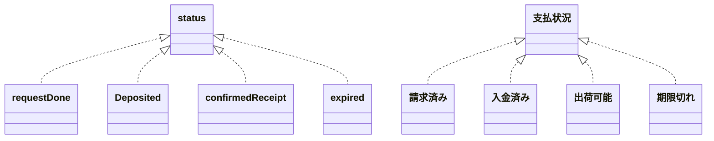

# alps-asd を触ってみようと思ったきっかけ

perlで書かれた「とある古のWebアプリ」を近年のPHPフレームワークで再現してみるのを個人開発でやろうと思っていて、その古のWebアプリに出てくる概念モデルをチマチマと抽出する作業がだいぶ前から中断していました。  
「何かちょっと新しい刺激を加えながら作業を再開したいな～」などと思っていたところ、alps-asd の話題がTwitterのTLに流れてきたのを見て下記のTweetを投げたのが始まり。

https://twitter.com/ClapAndWhistle/status/1574033283330887680

このごろ「ちゃんとRESTを意識してアプリケーションを作ること」に馴染むべく [BEAR.Sunday](https://bearsunday.github.io/index.html) を触っています。そこへ、 alps-asd はそのBEAR.Sunday作者様が牽引しているプロジェクトのようだと見えたので、とても気になりました。

というわけで、今回は alps-asd を触ってみた所感を記事にしてみたいと思います。  
（なお、当記事の内容では「とある古のWebアプリ」と直接関係する題材は扱ってません）

# ひとまずチュートリアルを触ってALPSを知る

[alps-asd のイントロダクション](https://alps-asd.github.io/manuals/1.0/ja/) にはクイックスタートやチュートリアルが用意されています。
これらに目を通しながらチュートリアルをこなし、まずは耳慣れない用語に自ら馴染みにかかる必要があると感じました。

## 独特な用語たち

チュートリアルでは、「どっかで聞いたことはある気がするけど、使ってる場面に遭遇したことは無い」とか「初耳！」と感じる用語がちょくちょく出てきます。  
中核となるらしき用語に対する現時点の私なりの理解を書いておきます。

### セマンティクス（Semantics）

語句の意味や（その語句単体を構成する）構造、って感じ？

### オントロジー（Ontology）

なんらかの分類システムに沿って対象を表現する要素（語彙）を提供するもの、とでも言おうか？

### タクソノミー（Taxonomy）

情報の構成や配置。
オントロジーが組み合わさって表現される「情報のひとかたまり」、とでも言おうか？

### コレオグラフィ（Choreography）

個々のオントロジーやタクソノミーの持つ振る舞いの記述、といったところかな？

マイクロサービスの文脈では  
ロジックが呼び出し側に集まりがちな「オーケストレーション」の課題を、  
「呼び出し側がパブリッシュするイベントを各マイクロサービス側で監視して処理結果をメッセージする」という手法で解決することもあるらしく、オーケストレーションに対するこの方式のことを「コレオグラフィ」と呼ぶのだそうな。「個々のマイクロサービスが各々で振る舞いを持つ」という意味合いが、alps-asdで使われているコレオグラフィと地続きな感じなのかもしれません。

## 雑感

```plain text
オントロジーの要素A ←[作用a]→ オントロジーの要素B
オントロジーの要素A ←[作用b]→ タクソノミーの要素A
タクソノミーの要素A ←[作用c]→ タクソノミーの要素B
```

といった相互の間にどんなコレオグラフィが割り当てられているかをALPSのschemaに準じたXMLやJSONで記述すれば、ASD というツールが図にして示してくれるのか。  
ひとまずそんな感じに理解した。

# 事前考察

## UMLと棲み分けるポイントがある？

UMLを使ったオブジェクト指向モデリングにおける概念モデル図で扱うような語彙の単位と、  
ALPSで扱う語彙の単位は必ずしも一致しないのかなー？
enumっぽいものを表現するとき、UMLだと私は「汎化」や「実現」で記述したりすることがある（もしかするとこれは邪道かも）。



ここで例に挙げた「enumっぽいもの」はまさに遷移していく状態そのものを表す語彙でもあるわけだけど、ALPSにおいてこれら一つ一つはオントロジーとなりそうな気がするけど、タクソノミーで表現するものではなさそうな気もする。  
コレオグラフィの結果たる「遷移後の状態」に内包される特定のセマンティックが変化することで表現されるものなのか？

ひとまず、「アプリケーションの状態の遷移 ≒ あるユースケースにまつわる状態の遷移」と考えて使ってみよう。

## アイデア

UMLのユースケース図で言うところの個々のユースケース記述に、ALPSで表現されるアプリケーション状態を一つ添える、ぐらいに使うとちょうど良かったりする？
ひとまず、「個々のユースケースの組み合わせ」を画面遷移になぞらえて状態遷移を表現する段に入ったら、各ユースケース間の遷移関係をALPSドキュメントで表現してみよう。

# ALPSで「銀行振込による商品購入」のワークフローを記述してみる

以下で示す **「銀行振込による商品購入」** にまつわる簡易モデリングにおいて、
 **「支払状況」が変化するシチュエーション（つまり「リソースの状態変化」）** だけを抜き出して簡易にAPI設計してみました。
このアプリケーション状態の遷移図を、ALPS初心者が alps-asd で書き出してみます。

## 簡易モデリング

最初に、簡単なモデリングの図を示すことで話の対象を絞り込みます。

### ユースケース図

※「ALPSによる状態遷移図」を書く対象は、下記ユースケース図内の角丸赤枠で囲った部分です。


### 概念モデル図

※「ALPSによる状態遷移図」で扱うオブジェクトは、下記概念モデル図内の角丸赤枠で囲った部分です。


## 簡易API設計

:::message
下記説明中の 1. はセッションから値を取ることを期待してるし、3. や 4. もユーザー認証済みのセッションが前提となるような操作なので、純粋なRESTアプリケーションのAPI設計とは呼べないかもですが、「RESTっぽく捉えられる部分」を alps-asd で表現してみることで効能を体感してみよう、という趣旨で書き進めていきます。
:::

| 詳細記述の<br />対応番号 | method | path | query | システムがやっていること<br />を日本語で記述 |
| :---: | --- | --- | --- | --- |
| 1. | get | /purchase | --- | `「購入の基本情報を入力する」` <br />の画面を表示する |
| 2. | post | /purchase | --- | ユーザーの入力内容を受け付けて<br /> `「請求情報を作成する」` の処理 |
| 3. | get | /purchase | id={手続きID} | 開始された購入手続きの情報を表示する |
| 4. | put | /purchase | id={手続きID}<br />action={deposited\|cancel} | `「入金した事を報告する」` や<br /> `「購入手続きをキャンセルする」` の<br />オペレーションを受け付けて処理する |

### 各APIエンドポイントの詳細記述

#### 1. 商品をカートに入れて購入手続き開始

- アクセス方法
  - method: get
  - path: /purchase
- 処理内容: セッション情報から次を取得して、以下の事項と基本情報入力欄を表示
  1. 選択された商品のID（１つ目）
      - 商品額
      - 購入個数
  2. 選択された商品のID（２つ目）
      - 商品額
      - 購入個数
  3. ...（３つ目以降）

#### 2. 購入の基本情報の入力を受け付ける

- アクセス方法
  - method: post
  - path: /purchase
- 処理内容: 次の事項を永続化する
  1. 入力された「購入の基本情報」へ一意に割り当てられる「手続きID」
  2. 当該の手続きで取り扱う商品の情報リスト
      - 個々の商品情報の構成
        - 商品のID
        - 商品額
        - 【ユーザー入力】個数
  3. 購入者の情報
      - 【ユーザー入力】氏名
      - 【ユーザー入力】お届け先住所
      - 【ユーザー入力】当該の手続きで支払いに使用する銀行口座の情報
  4. 支払額合計
  5. 支払期限
  6. 支払状況

#### 3. 開始された購入手続きの情報を表示する

- アクセス方法
  - method: get
  - path: /purchase
  - query: id={手続きID}
- 処理内容: 「購入の基本情報」を表示の上で、次のボタンを提供する
  1. 「入金しました」ボタン
      - 支払状況に応じて次のように表示が変化する
        - 入金済み（非ボタン）
        - 出荷可能（非ボタン）
        - 期限切れ（非ボタン）
  2. 「購入をキャンセルします」ボタン
      - 支払状況が「期限切れ」の場合は表示不要

#### 4. 「購入手続きの情報」の状態を更新する

- アクセス方法
  - method: put
  - path: /purchase
  - query: id={手続きID}&action={deposited|cancel}
- 処理内容: 「入金した」あるいは「キャンセルした」という事実を記録する

### ALPS で書いた状態遷移図

上記までで示した「ユースケース図・概念モデル図・API設計」だけだと、 **アプリケーションの状態がどのように遷移するか** を読み取るには、次のような情報を補足する必要がありそうです。
- ユースケース図のどの部分がどのAPIと対応するのか？
- 概念モデル図で示した各種概念は、どのAPIによってアプリケーション上で状態として保存されるのか？

ALPSで記述したドキュメントは、これらを表現することに効果を発揮しそうな気がします。

#### Application State Diagram (idで表示)


#### Application State Diagram (titleで表示)


:::details profile.xml の記述内容を見るにはこのトグルを開いてください
```xml
<?xml version="1.0" encoding="UTF-8"?>
<alps
  xmlns:xsi="http://www.w3.org/2001/XMLSchema-instance"
  xsi:noNamespaceSchemaLocation="https://alps-io.github.io/schemas/alps.xsd">

  <!-- Ontology -->
  <descriptor id="purchaseId" title="手続きID"/>
  <descriptor id="productInfo" title="商品の情報" />
  <descriptor id="purchaserInfo" title="購入者の情報" />
  <descriptor id="dueDate" title="支払期限" />
  <descriptor id="paymentTotal" title="支払合計額" />
  <descriptor id="paymentStatusDeposited" title="入金した" />
  <descriptor id="paymentStatusCancel" title="キャンセルした" />

  <!-- Taxonomy -->
  <descriptor id="paymentStatus" title="支払状況">
    <descriptor href="#paymentStatusDeposited" />
    <descriptor href="#paymentStatusCancel" />
  </descriptor>

  <descriptor id="purchaseBasicInfo" title="購入の基本情報">
    <descriptor href="#purchaseId" />
    <descriptor href="#productInfo" />
    <descriptor href="#purchaserInfo" />
    <descriptor href="#dueDate" />
    <descriptor href="#paymentTotal" />
    <descriptor href="#paymentStatus" />
  </descriptor>

  <descriptor id="Cart" title="ショッピングカート画面" >
    <descriptor href="#productInfo" />
    <descriptor href="#goPurchase" />
  </descriptor>

  <descriptor id="Index" title="購入一覧" >
    <descriptor href="#purchaseId" />
    <descriptor href="#dueDate" />
    <descriptor href="#paymentTotal" />
    <descriptor href="#paymentStatus" />
    <descriptor href="#goPurchaseDetail" />
  </descriptor>

  <descriptor id="Purchase" title="購入手続き画面" >
    <descriptor href="#productInfo" />
    <descriptor href="#purchaserInfo" />
    <descriptor href="#dueDate" />
    <descriptor href="#paymentTotal" />
    <descriptor href="#paymentStatus" />
    <descriptor href="#goPurchasePosting" />
  </descriptor>

  <descriptor id="PurchasePosting" title="購入内容受け付け" >
    <descriptor href="#purchaseId" />
    <descriptor href="#purchaserInfo" />
    <descriptor href="#dueDate" />
    <descriptor href="#paymentTotal" />
    <descriptor href="#paymentStatus" />
    <descriptor href="#goPurchaseDetail" />
  </descriptor>

  <descriptor id="PurchaseDetail" title="購入詳細画面" >
    <descriptor href="#purchaseBasicInfo" />
    <descriptor href="#goIndex" />
    <descriptor href="#doPurchaseProgressPay" />
    <descriptor href="#doPurchaseProgressCancel" />
  </descriptor>

  <descriptor id="PurchaseProgressPay" title="購入手続き入金" >
    <descriptor href="#purchaseId" />
    <descriptor href="#paymentStatus">
      <descriptor href="#paymentStatusDeposited" />
    </descriptor>
    <descriptor href="#goPurchaseDetail" />
  </descriptor>

  <descriptor id="PurchaseProgressCancel" title="購入手続きキャンセル" >
    <descriptor href="#purchaseId" />
    <descriptor href="#paymentStatus">
      <descriptor href="#paymentStatusCancel" />
    </descriptor>
    <descriptor href="#goPurchaseDetail" />
  </descriptor>

  <!-- Choreography -->

  <descriptor type="safe" id="goIndex" rt="#Index" title="購入一覧を見る" />
  <descriptor type="safe" id="goPurchaseDetail" rt="#PurchaseDetail" title="購入詳細を見る" />
  <descriptor type="safe" id="goPurchase" rt="#Purchase" title="購入手続き画面へ進む" />
  <descriptor type="unsafe" id="goPurchasePosting" rt="#PurchasePosting" title="購入内容を登録する" />
  <descriptor type="idempotent" id="doPurchaseProgressPay" rt="#PurchaseProgressPay" title="入金報告する" />
  <descriptor type="idempotent" id="doPurchaseProgressCancel" rt="#PurchaseProgressCancel" title="購入をキャンセルする" />
</alps>
```
:::

# ちょっとした感想

- docs/配下に既存だった（公式チュートリアルの） `semantic.**.html` や `safe.**.html` といったファイル、 profile.xml から除去しても連動して削除されたりはしないのね。
- API同士のワークフローを表現することがALPSドキュメントの目的、と考えたらいいのか？
  - BAER.Sundayで例えるなら、「商品詳細」の状態が paymentStatus の種類の分だけあるとして、「それぞれの状態に応じた WorkflowTest を書く必要がある」ことを明確にできる、という感じ？

## 判っていないところ

### 紐付けがまだされてないノードの見分け方

どのタクソノミにも　**関連付けられていないオントロジーやコレオグラフィ** がまだあるのかどうか、ひと目で判る仕組みが既にあったりするのか？

### Enumっぽい性格の概念のオントロジーの扱い方

paymentStatus の Enumっぽい性格を Application State Diagram 上でどう表現したらいいのだろう？

- 下記例で言えば「何で」と「どうなる」を一度のダイアグラム描画で表現できるの？というところ。
  - 「PurchaseProgressCancel（購入手続きキャンセル）」で変わるのはいったい何で、どうなる？
    ```
    変わるのは「paymentStatus（支払状況）」
    これが「paymentStatusCancel（キャンセルした）」になる。
    ```
  - 「PurchaseProgressPay（購入手続き入金）」で変わるのはいったい何で、どうなる？
    ```
    変わるのは「paymentStatus（支払状況）」
    これが「paymentStatusDeposited（入金した）」になる。
    ```
